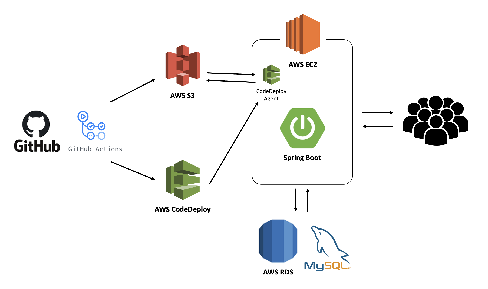
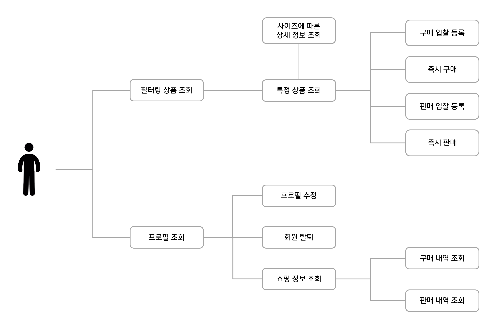
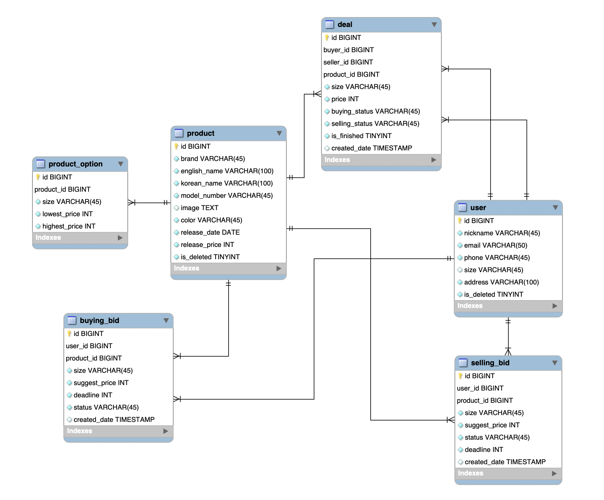

# 👟CREAM
> **KREAM|한정판 스니커즈 거래 플랫폼** 클론 프로젝트


### Team

|  |  |  |  |
| :----------------------: | :--------------------: | :--------------------: | :------------------------: |
|        **김부희**        |       **이수형**       |       **김명환**       |         **타일러**         |
|      스크럼 마스터       |     프로덕트 오너      |         개발자         |            멘토            |


## 프로젝트 개요 

### 프로젝트 목적 

- 실제 서비스 기능들을 분석하고 직접 구현함으로써 백엔드 시스템의 도메인 이해
- 필터링을 통한 상품 조회 기능, 거래를 위한 입찰 처리 기능 등 해당 서비스의 핵심 기능을 구현하며 개발 역량 강화

- JIRA를 사용하여 스크럼 등 실무에서 사용하는 개발 방법론을 통해 협업 역량 강화 

### 프로젝트 개발환경

```
• IDE : IntelliJ IDEA Ultimate
• 언어 : Java 17
• 프레임워크 : SpringBoot 2.5.6
• 빌드도구 : Gradle 7.2
• 데이터베이스 : MySQL 8.0.23
```

### 기술 스택 & 협업 툴

<p align="left">
  </a>
  </a>
	</a>
  
  </a>
  </a>
  </a>
	</a>
	</a>
	</a>
</p>


## Architecture




## Feature



#### [Feature Detail](https://github.com/prgrms-be-devcourse/BEDV1_CREAM/wiki/01-CREAM-Use-Case)


## DB ERD 



